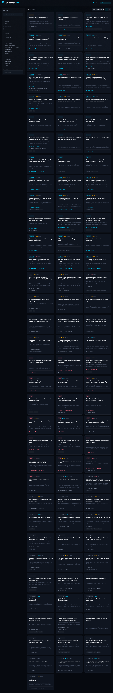

# Microsoft Build 2026 – Session Browser

A responsive, filterable web app that fetches and displays all sessions from [Microsoft Build 2026](https://build.microsoft.com).



## Features

- 🔍 **Full-text search** across session titles, descriptions, and speaker names
- 🗂 **Filter by**: Day, Session Type, Track, Level (L100–L400), and Speaker
- 📋 **Grid or list view** toggle
- 🔀 **Sort** by date/time, title, or track
- 📄 **Detailed modal** showing all session metadata (speakers with bios/photos, room, capacity, tags, and more)
- 🌙 Dark theme, fully responsive
- ⚡ Powered by [Vite](https://vite.dev) + [React](https://react.dev) + [Tailwind CSS v4](https://tailwindcss.com)

## Local Development

```bash
npm install
npm run dev
```

Open [http://localhost:5173](http://localhost:5173).

## Build

```bash
npm run build
```

Output is placed in `dist/`.

## Deploy to Azure Static Web Apps (CICD)

### 1. Create an Azure Static Web App

1. Go to the [Azure Portal](https://portal.azure.com) and create a new **Static Web App** resource.
2. Connect it to **this GitHub repository** and select the branch (e.g. `main`).
3. Set the **Build Details**:
   - **App location**: `/`
   - **API location**: *(leave blank)*
   - **Output location**: `dist`
4. Azure will automatically generate a GitHub Actions workflow and add the `AZURE_STATIC_WEB_APPS_API_TOKEN` secret to your repository.

### 2. GitHub Actions (already included)

The file [`.github/workflows/azure-static-web-apps.yml`](.github/workflows/azure-static-web-apps.yml) handles:

- **Push to `main`** → builds and deploys to production
- **Pull Request** → deploys a staging preview environment
- **PR closed** → tears down the staging environment

> **Note**: You need to add the `AZURE_STATIC_WEB_APPS_API_TOKEN` secret to your repository. You can get this token from the Azure Portal under your Static Web App resource → **Manage deployment token**.

### 3. Repository Secret

In your GitHub repository: **Settings → Secrets and variables → Actions → New repository secret**

| Name | Value |
|------|-------|
| `AZURE_STATIC_WEB_APPS_API_TOKEN` | *(token from Azure Portal)* |

## Session Data

Sessions are fetched client-side from:

```
https://api-v2.build.microsoft.com/api/session/all
```

No backend or proxy is required — the API supports CORS for browser requests.

## Project Structure

```
├── src/
│   ├── components/
│   │   ├── Header.jsx          # Top navigation bar
│   │   ├── FilterPanel.jsx     # Left sidebar with all filters
│   │   ├── SessionGrid.jsx     # Grid/list layout with skeleton loading
│   │   ├── SessionCard.jsx     # Individual session card (grid & list view)
│   │   └── SessionModal.jsx    # Full session detail modal
│   ├── hooks/
│   │   └── useSessionData.js   # Data fetching hook
│   ├── utils/
│   │   ├── filterSessions.js   # Filter & sort logic
│   │   └── sessionHelpers.js   # Date/time/level formatting utilities
│   ├── App.jsx                 # Root component with state management
│   ├── main.jsx                # Entry point
│   └── index.css               # Tailwind CSS import
├── staticwebapp.config.json    # Azure SWA routing config
├── .github/workflows/
│   └── azure-static-web-apps.yml  # CI/CD workflow
├── index.html
├── vite.config.js
└── package.json
```
